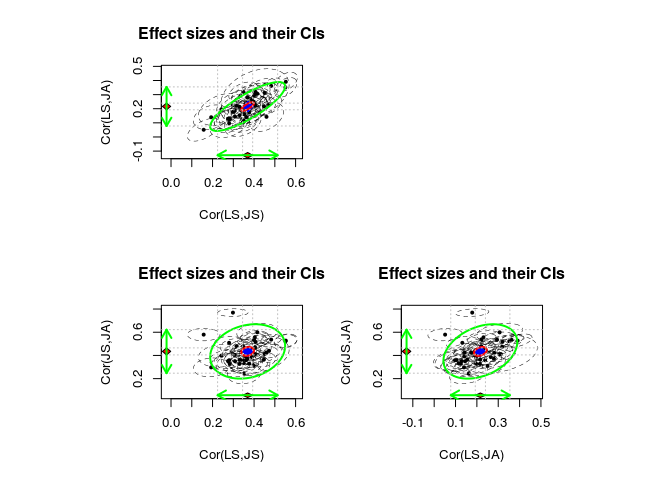
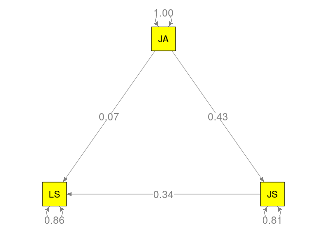
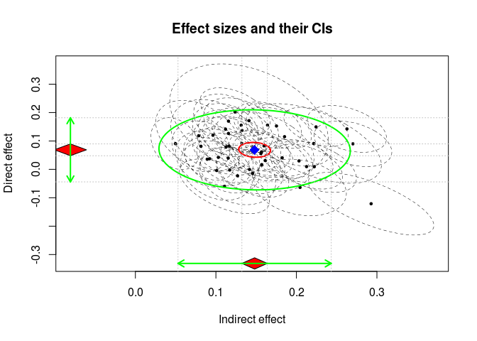
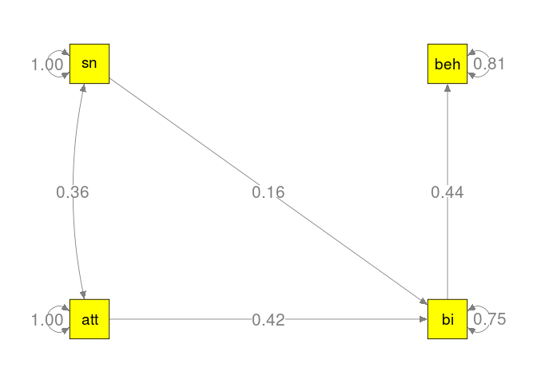
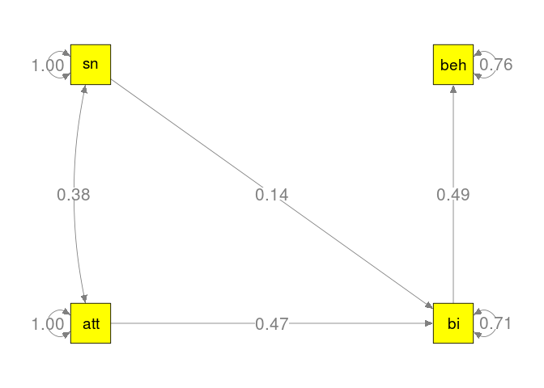

# Correlation-based versus parameter-based MASEM
Mike W.-L. Cheung and Shu Fai Cheung  
`r format(Sys.time(), '%d %B, %Y')`  

This file includes examples used in Cheung and Cheung (2016):

Cheung, M.W.-L., and Cheung, S.-F. (2016). Random effects models for meta-analytic structural equation modeling: Review, issues, and illustrations. *Research Synthesis Methods*, *7*(2), 140–155. http://doi.org/10.1002/jrsm.1166.

# Installing the R packages
* R can be downloaded at http://www.r-project.org/.
* Before running the analyses, we need to install some R packages and download the data. 
* We only need to install them once.

```r
## Installing R packages from the CRAN
install.packages(c("semPlot", "lavaan", "metaSEM"))
```

# Illustration 1: World Values Survey

## Show some sample data

```r
## Load the libraries for TSSEM
library("metaSEM")
library("semPlot")
library("lavaan")

## Display some data
head(wvs94b$data)
```

```
## $france
##          LS       JS       JA
## LS 3.177214 1.355090 1.131718
## JS 1.355090 3.898144 2.372865
## JA 1.131718 2.372865 7.034310
## 
## $britain
##           LS       JS        JA
## LS 3.0906124 1.305764 0.6298882
## JS 1.3057637 4.213234 2.0351779
## JA 0.6298882 2.035178 6.4146887
## 
## $wgermany
##          LS       JS       JA
## LS 2.926122 1.232729 1.291051
## JS 1.232729 3.132200 2.161086
## JA 1.291051 2.161086 5.578932
## 
## $italy
##          LS       JS       JA
## LS 3.686455 1.891624 1.160637
## JS 1.891624 4.357002 2.398691
## JA 1.160637 2.398691 6.819014
## 
## $nethland
##           LS        JS        JA
## LS 1.8066423 0.5455268 0.5927539
## JS 0.5455268 2.8032735 1.5050056
## JA 0.5927539 1.5050056 5.0953228
## 
## $denmark
##           LS        JS        JA
## LS 2.4411541 0.7349914 0.4666241
## JS 0.7349914 2.7641231 1.3065347
## JA 0.4666241 1.3065347 5.7448539
```

```r
## Display some sample sizes
head(wvs94b$n)
```

```
##   france  britain wgermany    italy nethland  denmark 
##      457      840     1160     1032      435      653
```

## Correlation-based MASEM

```r
## First stage of TSSEM: Random-effects model
rand1 <- tssem1(wvs94b$data, wvs94b$n, method="REM")

## Show the summary
summary(rand1)
```

```
## 
## Call:
## meta(y = ES, v = acovR, RE.startvalues = RE.startvalues, RE.lbound = RE.lbound, 
##     I2 = I2, model.name = model.name, suppressWarnings = TRUE, 
##     silent = silent, run = run)
## 
## 95% confidence intervals: z statistic approximation
## Coefficients:
##               Estimate   Std.Error      lbound      ubound z value
## Intercept1  0.36901529  0.01239937  0.34471297  0.39331761 29.7608
## Intercept2  0.21622132  0.01214022  0.19242693  0.24001571 17.8103
## Intercept3  0.43474463  0.01550976  0.40434606  0.46514321 28.0304
## Tau2_1_1    0.00544077  0.00137531  0.00274521  0.00813632  3.9560
## Tau2_2_1    0.00428699  0.00119632  0.00194225  0.00663174  3.5835
## Tau2_2_2    0.00498962  0.00131545  0.00241138  0.00756787  3.7931
## Tau2_3_1    0.00141868  0.00125671 -0.00104442  0.00388178  1.1289
## Tau2_3_2    0.00232886  0.00127524 -0.00017057  0.00482830  1.8262
## Tau2_3_3    0.00917325  0.00215267  0.00495409  0.01339240  4.2613
##             Pr(>|z|)    
## Intercept1 < 2.2e-16 ***
## Intercept2 < 2.2e-16 ***
## Intercept3 < 2.2e-16 ***
## Tau2_1_1   7.620e-05 ***
## Tau2_2_1   0.0003390 ***
## Tau2_2_2   0.0001488 ***
## Tau2_3_1   0.2589451    
## Tau2_3_2   0.0678186 .  
## Tau2_3_3   2.032e-05 ***
## ---
## Signif. codes:  0 '***' 0.001 '**' 0.01 '*' 0.05 '.' 0.1 ' ' 1
## 
## Q statistic on the homogeneity of effect sizes: 1393.029
## Degrees of freedom of the Q statistic: 123
## P value of the Q statistic: 0
## 
## Heterogeneity indices (based on the estimated Tau2):
##                              Estimate
## Intercept1: I2 (Q statistic)   0.8646
## Intercept2: I2 (Q statistic)   0.8256
## Intercept3: I2 (Q statistic)   0.9287
## 
## Number of studies (or clusters): 42
## Number of observed statistics: 126
## Number of estimated parameters: 9
## Degrees of freedom: 117
## -2 log likelihood: -300.9827 
## OpenMx status1: 0 ("0" or "1": The optimization is considered fine.
## Other values may indicate problems.)
```

```r
## Plot the effect sizes
plot.meta(rand1, axis.labels=c("Cor(LS,JS)", "Cor(LS,JA)", "Cor(JS,JA)"), 
          study.min.cex=0.5, main="Effect sizes and their CIs")
```

<!-- -->

```r
## Build a model with indirect effect
## A1: Regression coefficients; 
## parameters are labelled with "a", "b", and "c"
## S1: Variance-covariance of parameters
A1 <- create.mxMatrix(c(0,"0.2*b","0.2*c",
                        0,0,"0.2*a",
                        0,0,0), 
    	                type="Full", ncol=3, nrow=3, as.mxMatrix=FALSE, byrow=TRUE)
dimnames(A1) <- list(c("LS","JS","JA"), c("LS","JS","JA"))
A1
```

```
##    LS  JS      JA     
## LS "0" "0.2*b" "0.2*c"
## JS "0" "0"     "0.2*a"
## JA "0" "0"     "0"
```

```r
S1 <- create.mxMatrix(c("0.2*Error_y","0.2*Error_m",1), type="Diag", as.mxMatrix=FALSE)
dimnames(S1) <- list(c("LS","JS","JA"), c("LS","JS","JA"))
S1
```

```
##    LS            JS            JA 
## LS "0.2*Error_y" "0"           "0"
## JS "0"           "0.2*Error_m" "0"
## JA "0"           "0"           "1"
```

```r
## Second stage of TSSEM: Random-effects model
## Estimate direct and indirect effects
rand2 <- tssem2(rand1, Amatrix=A1, Smatrix=S1, 
                diag.constraints=TRUE, intervals.type="LB",
                mx.algebras=list( indirect=mxAlgebra(a*b, name="indirect"), 
                                  direct=mxAlgebra(c, name="direct") ))

## Show the summary
summary(rand2)
```

```
## 
## Call:
## wls(Cov = pooledS, asyCov = asyCov, n = tssem1.obj$total.n, Amatrix = Amatrix, 
##     Smatrix = Smatrix, Fmatrix = Fmatrix, diag.constraints = diag.constraints, 
##     cor.analysis = cor.analysis, intervals.type = intervals.type, 
##     mx.algebras = mx.algebras, model.name = model.name, suppressWarnings = suppressWarnings, 
##     silent = silent, run = run)
## 
## 95% confidence intervals: Likelihood-based statistic
## Coefficients:
##         Estimate Std.Error   lbound   ubound z value Pr(>|z|)
## b       0.339106        NA 0.316695 0.361668      NA       NA
## c       0.068797        NA 0.048191 0.089256      NA       NA
## a       0.434745        NA 0.404330 0.465235      NA       NA
## Error_y 0.859989        NA 0.840562 0.878149      NA       NA
## Error_m 0.810997        NA 0.783640 0.836509      NA       NA
## 
## mxAlgebras objects (and their 95% likelihood-based CIs):
##                   lbound   Estimate     ubound
## indirect[1,1] 0.13241014 0.14742465 0.16352622
## direct[1,1]   0.04819121 0.06879667 0.08925548
## 
## Goodness-of-fit indices:
##                                              Value
## Sample size                                35663.0
## Chi-square of target model                     0.0
## DF of target model                             0.0
## p value of target model                        0.0
## Number of constraints imposed on "Smatrix"     2.0
## DF manually adjusted                           0.0
## Chi-square of independence model            1601.7
## DF of independence model                       3.0
## RMSEA                                          0.0
## RMSEA lower 95% CI                             0.0
## RMSEA upper 95% CI                             0.0
## SRMR                                           0.0
## TLI                                           -Inf
## CFI                                            1.0
## AIC                                            0.0
## BIC                                            0.0
## OpenMx status1: 0 ("0" or "1": The optimization is considered fine.
## Other values indicate problems.)
```

```r
## Plot the model
my.plot1 <- meta2semPlot(rand2)
semPaths(my.plot1, whatLabels="est", edge.label.cex=1.5, sizeMan=8, color="yellow")
```

<!-- -->

## Parameter-based MASEM

```r
## First stage of analysis: Extract the direct 
## and indirect effects per study
(indirect1 <- indirectEffect(wvs94b$data, wvs94b$n))
```

```
##             ind_eff       dir_eff      ind_var   ind_dir_cov      dir_var
## france   0.15978141  0.0827522461 0.0006412924 -4.649454e-04 0.0024374059
## britain  0.14168820 -0.0002263007 0.0002888310 -1.626571e-04 0.0012216599
## wgermany 0.17524960  0.1527287443 0.0003158081 -2.684000e-04 0.0010394339
## italy    0.20321234  0.0296684559 0.0002994225 -1.503761e-04 0.0009550049
## nethland 0.07862686  0.1185534103 0.0004741621 -4.167198e-04 0.0025940000
## denmark  0.08921949  0.0357811049 0.0002580830 -1.633167e-04 0.0015946257
## belgium  0.18234893  0.0406592228 0.0002430000 -1.638546e-04 0.0008544332
## spain    0.15684423  0.0166711391 0.0001385408 -8.530734e-05 0.0005433748
## ireland  0.20451372 -0.0635826273 0.0005530175 -2.113689e-04 0.0016560481
## nireland 0.14117359  0.1715056590 0.0016206049 -1.130507e-03 0.0066716297
## usa      0.21260852  0.0097460305 0.0003352506 -2.565373e-04 0.0010396340
## canada   0.15592998  0.0559244096 0.0002674737 -1.924936e-04 0.0010345513
## japan    0.29279253 -0.1210110214 0.0010138128 -9.983440e-04 0.0020297107
## mexico   0.27017766  0.0899476460 0.0003898565 -2.364167e-04 0.0010783334
## s africa 0.22436811  0.1495906062 0.0002662679 -2.111175e-04 0.0007991767
## hungary  0.11562915  0.1698171076 0.0003129404 -2.141807e-04 0.0015091523
## norway   0.11717420 -0.0022129617 0.0002263148 -1.070791e-04 0.0010993010
## sweden   0.14566226 -0.0139555980 0.0003337621 -2.806301e-04 0.0011881523
## iceland  0.10093202 -0.0039303487 0.0003330384 -2.163154e-04 0.0018302047
## argentin 0.12691382 -0.0226665411 0.0003765071 -1.909892e-04 0.0017249274
## finland  0.22153359  0.0911586195 0.0011790783 -1.065998e-03 0.0032807259
## skorea   0.26277918  0.1425267795 0.0004037433 -2.710684e-04 0.0011330304
## poland   0.11064977 -0.0597440130 0.0005223964 -4.938223e-04 0.0015451010
## switz    0.22223141  0.0093824791 0.0004566021 -3.589338e-04 0.0013705545
## brazil   0.13247467  0.1370104166 0.0002408544 -1.562138e-04 0.0010596832
## nigeria  0.11195614  0.1413833557 0.0002809950 -1.339513e-04 0.0013614816
## chile    0.11531262  0.0395808318 0.0002566581 -1.571078e-04 0.0012826150
## byelorus 0.11559917  0.1265705841 0.0002316383 -1.473846e-04 0.0011406506
## india    0.15666943  0.0614854223 0.0002108708 -9.139084e-05 0.0007803188
## czech    0.09205198  0.0373221695 0.0001602023 -1.109053e-04 0.0009425369
## egermany 0.12373178  0.2026104203 0.0003151898 -2.791858e-04 0.0011981493
## slovenia 0.11637801  0.0818733474 0.0003582661 -1.800883e-04 0.0017417019
## bulgaria 0.18526507  0.1151116394 0.0005613585 -4.807255e-04 0.0017873385
## romania  0.16122303  0.0311905394 0.0005047971 -3.320222e-04 0.0019349102
## china    0.16410105  0.1558057384 0.0002975283 -1.823033e-04 0.0011034250
## portugal 0.10308383  0.0423772969 0.0003103805 -1.961384e-04 0.0016971350
## austria  0.08144816  0.0812577522 0.0002187153 -7.889336e-05 0.0013385159
## turkey   0.09635417  0.1202190099 0.0004596091 -2.861366e-04 0.0026423311
## lithuan  0.04971958  0.0906342006 0.0001545078 -1.259299e-04 0.0013986628
## latvia   0.13141244  0.1555683548 0.0003631150 -2.769157e-04 0.0015455950
## estonia  0.13213639  0.0910846395 0.0003962934 -3.409209e-04 0.0015314712
## russia   0.11256496  0.0784023947 0.0001841914 -1.407663e-04 0.0008853345
```

```r
## Second stage of analysis: Multivariate meta-analysis on 
## the direct and indirect effect sizes
indirect2 <- meta(indirect1[, c("ind_eff", "dir_eff")], 
                  indirect1[, c("ind_var", "ind_dir_cov", "dir_var")], intervals.type="z")

## Show the summary
summary(indirect2)  
```

```
## 
## Call:
## meta(y = indirect1[, c("ind_eff", "dir_eff")], v = indirect1[, 
##     c("ind_var", "ind_dir_cov", "dir_var")], intervals.type = "z")
## 
## 95% confidence intervals: z statistic approximation
## Coefficients:
##               Estimate   Std.Error      lbound      ubound z value
## Intercept1  1.4809e-01  8.0686e-03  1.3228e-01  1.6390e-01 18.3538
## Intercept2  6.8795e-02  1.0638e-02  4.7944e-02  8.9646e-02  6.4667
## Tau2_1_1    2.3571e-03  6.0243e-04  1.1764e-03  3.5379e-03  3.9127
## Tau2_2_1   -8.0175e-05  5.7034e-04 -1.1980e-03  1.0377e-03 -0.1406
## Tau2_2_2    3.3174e-03  1.0386e-03  1.2818e-03  5.3529e-03  3.1942
##             Pr(>|z|)    
## Intercept1 < 2.2e-16 ***
## Intercept2 1.002e-10 ***
## Tau2_1_1   9.129e-05 ***
## Tau2_2_1    0.888208    
## Tau2_2_2    0.001402 ** 
## ---
## Signif. codes:  0 '***' 0.001 '**' 0.01 '*' 0.05 '.' 0.1 ' ' 1
## 
## Q statistic on the homogeneity of effect sizes: 561.9791
## Degrees of freedom of the Q statistic: 82
## P value of the Q statistic: 0
## 
## Heterogeneity indices (based on the estimated Tau2):
##                              Estimate
## Intercept1: I2 (Q statistic)   0.8838
## Intercept2: I2 (Q statistic)   0.7198
## 
## Number of studies (or clusters): 42
## Number of observed statistics: 84
## Number of estimated parameters: 5
## Degrees of freedom: 79
## -2 log likelihood: -232.1644 
## OpenMx status1: 0 ("0" or "1": The optimization is considered fine.
## Other values may indicate problems.)
```

```r
## Plot the indirect and direct effects as effect sizes
plot.meta(indirect2, axis.labels=c("Indirect effect", "Direct effect"),
          study.min.cex=0.5, main="Effect sizes and their CIs")
```

<!-- -->

# Illustration 2: Theory of Planned Behavior

## Show some sample data and check the data

```r
## Display some data
head(Cheung00$data)
```

```
## $`Ajzen & Madden (1986a)`
##       att    sn   bi  beh
## att 1.000 0.332 0.51   NA
## sn  0.332 1.000 0.35   NA
## bi  0.510 0.350 1.00 0.36
## beh    NA    NA 0.36 1.00
## 
## $`Ajzen & Madden (1986b)`
##       att    sn   bi  beh
## att 1.000 0.261 0.48   NA
## sn  0.261 1.000 0.11   NA
## bi  0.480 0.110 1.00 0.26
## beh    NA    NA 0.26 1.00
## 
## $`Louies (1996)`
##       att    sn    bi   beh
## att 1.000 0.355 0.469 0.308
## sn  0.355 1.000 0.328 0.105
## bi  0.469 0.328 1.000 0.519
## beh 0.308 0.105 0.519 1.000
## 
## $`Borgida & Conner (1992)`
##      att   sn   bi beh
## att 1.00 0.26 0.39  NA
## sn  0.26 1.00 0.12  NA
## bi  0.39 0.12 1.00  NA
## beh   NA   NA   NA   1
## 
## $`Courneya & Mcauley (1995)`
##      att    sn    bi  beh
## att 1.00  0.07  0.29 0.01
## sn  0.07  1.00 -0.10 0.11
## bi  0.29 -0.10  1.00 0.46
## beh 0.01  0.11  0.46 1.00
## 
## $`Courneya, Nigg, & Estabrooks (1998)`
##      att   sn   bi  beh
## att 1.00 0.48 0.49 0.18
## sn  0.48 1.00 0.51 0.08
## bi  0.49 0.51 1.00 0.49
## beh 0.18 0.08 0.49 1.00
```

```r
## Display some sample sizes
head(Cheung00$n)
```

```
##              Ajzen & Madden (1986a)              Ajzen & Madden (1986b) 
##                                 169                                  90 
##                       Louies (1996)             Borgida & Conner (1992) 
##                                 238                                 201 
##           Courneya & Mcauley (1995) Courneya, Nigg, & Estabrooks (1998) 
##                                  62                                 131
```

```r
# Check pd in the data
pd_check <- is.pd(Cheung00$data)
sum(!is.na(pd_check))
```

```
## [1] 29
```

```r
## Studies with positive definite matrices happen to be studies without missing data.
my.pd <- list()
my.pd$data <- Cheung00$data[!is.na(pd_check)]
my.pd$n <- Cheung00$n[!is.na(pd_check)]

# No. of studies: All data
pattern.na(Cheung00$data, show.na=FALSE)
```

```
##     att sn bi beh
## att  50 46 50  29
## sn   46 50 50  29
## bi   50 50 50  44
## beh  29 29 44  50
```

```r
# No. of studies: Positive definite
pattern.na(my.pd$data, show.na=FALSE)
```

```
##     att sn bi beh
## att  29 29 29  29
## sn   29 29 29  29
## bi   29 29 29  29
## beh  29 29 29  29
```

```r
# Sample sizes: All data
pattern.n(Cheung00$data, Cheung00$n)
```

```
##      att   sn   bi  beh
## att 8182 7781 8182 4454
## sn  7781 8182 8182 4454
## bi  8182 8182 8182 6520
## beh 4454 4454 6520 8182
```

```r
# Sample sizes: Positive definite
pattern.n(my.pd$data, my.pd$n)
```

```
##      att   sn   bi  beh
## att 4454 4454 4454 4454
## sn  4454 4454 4454 4454
## bi  4454 4454 4454 4454
## beh 4454 4454 4454 4454
```

## Correlation-based MASEM

```r
## Stage 1 analysis: Random-effects model
## All studies used.
tra_random_1 <- tssem1(Cheung00$data, Cheung00$n, method="REM")
summary(tra_random_1)
```

```
## 
## Call:
## meta(y = ES, v = acovR, RE.startvalues = RE.startvalues, RE.lbound = RE.lbound, 
##     I2 = I2, model.name = model.name, suppressWarnings = TRUE, 
##     silent = silent, run = run)
## 
## 95% confidence intervals: z statistic approximation
## Coefficients:
##               Estimate   Std.Error      lbound      ubound z value
## Intercept1  3.5786e-01  2.5405e-02  3.0806e-01  4.0765e-01 14.0860
## Intercept2  4.8609e-01  2.1221e-02  4.4450e-01  5.2768e-01 22.9063
## Intercept3  2.7404e-01  2.9832e-02  2.1557e-01  3.3251e-01  9.1862
## Intercept4  3.0912e-01  2.2665e-02  2.6470e-01  3.5355e-01 13.6384
## Intercept5  1.3441e-01  2.4022e-02  8.7324e-02  1.8149e-01  5.5951
## Intercept6  4.3889e-01  2.5076e-02  3.8975e-01  4.8804e-01 17.5023
## Tau2_1_1    2.3687e-02  6.2407e-03  1.1455e-02  3.5918e-02  3.7955
## Tau2_2_1    7.6584e-03  4.2201e-03 -6.1288e-04  1.5930e-02  1.8147
## Tau2_2_2    1.6694e-02  4.3197e-03  8.2274e-03  2.5160e-02  3.8646
## Tau2_3_1   -1.3554e-03  5.9081e-03 -1.2935e-02  1.0224e-02 -0.2294
## Tau2_3_2    9.8326e-03  5.0190e-03 -4.4662e-06  1.9670e-02  1.9591
## Tau2_3_3    2.0259e-02  6.8302e-03  6.8721e-03  3.3646e-02  2.9661
## Tau2_4_1    1.5840e-02  4.9187e-03  6.1999e-03  2.5481e-02  3.2204
## Tau2_4_2    8.2122e-03  3.6143e-03  1.1282e-03  1.5296e-02  2.2721
## Tau2_4_3    8.4792e-04  4.7933e-03 -8.5468e-03  1.0243e-02  0.1769
## Tau2_4_4    1.8448e-02  5.0346e-03  8.5806e-03  2.8316e-02  3.6643
## Tau2_5_1    3.0916e-03  4.8632e-03 -6.4401e-03  1.2623e-02  0.6357
## Tau2_5_2    2.1540e-03  3.8727e-03 -5.4364e-03  9.7443e-03  0.5562
## Tau2_5_3    8.5391e-03  4.3973e-03 -7.9458e-05  1.7158e-02  1.9419
## Tau2_5_4    4.8330e-03  4.0362e-03 -3.0779e-03  1.2744e-02  1.1974
## Tau2_5_5    8.1852e-03  4.0754e-03  1.9754e-04  1.6173e-02  2.0084
## Tau2_6_1   -5.0488e-03  4.5104e-03 -1.3889e-02  3.7914e-03 -1.1194
## Tau2_6_2    2.4050e-03  3.8909e-03 -5.2210e-03  1.0031e-02  0.6181
## Tau2_6_3    1.3528e-02  5.0639e-03  3.6029e-03  2.3453e-02  2.6715
## Tau2_6_4   -2.5042e-03  3.8827e-03 -1.0114e-02  5.1058e-03 -0.6450
## Tau2_6_5    6.7686e-03  3.8473e-03 -7.7193e-04  1.4309e-02  1.7593
## Tau2_6_6    2.0749e-02  5.5565e-03  9.8587e-03  3.1640e-02  3.7342
##             Pr(>|z|)    
## Intercept1 < 2.2e-16 ***
## Intercept2 < 2.2e-16 ***
## Intercept3 < 2.2e-16 ***
## Intercept4 < 2.2e-16 ***
## Intercept5 2.205e-08 ***
## Intercept6 < 2.2e-16 ***
## Tau2_1_1   0.0001473 ***
## Tau2_2_1   0.0695643 .  
## Tau2_2_2   0.0001113 ***
## Tau2_3_1   0.8185430    
## Tau2_3_2   0.0501041 .  
## Tau2_3_3   0.0030161 ** 
## Tau2_4_1   0.0012800 ** 
## Tau2_4_2   0.0230792 *  
## Tau2_4_3   0.8595909    
## Tau2_4_4   0.0002480 ***
## Tau2_5_1   0.5249624    
## Tau2_5_2   0.5780811    
## Tau2_5_3   0.0521499 .  
## Tau2_5_4   0.2311484    
## Tau2_5_5   0.0445970 *  
## Tau2_6_1   0.2629835    
## Tau2_6_2   0.5365056    
## Tau2_6_3   0.0075522 ** 
## Tau2_6_4   0.5189573    
## Tau2_6_5   0.0785234 .  
## Tau2_6_6   0.0001883 ***
## ---
## Signif. codes:  0 '***' 0.001 '**' 0.01 '*' 0.05 '.' 0.1 ' ' 1
## 
## Q statistic on the homogeneity of effect sizes: 1334.942
## Degrees of freedom of the Q statistic: 242
## P value of the Q statistic: 0
## 
## Heterogeneity indices (based on the estimated Tau2):
##                              Estimate
## Intercept1: I2 (Q statistic)   0.8387
## Intercept2: I2 (Q statistic)   0.8428
## Intercept3: I2 (Q statistic)   0.7927
## Intercept4: I2 (Q statistic)   0.7901
## Intercept5: I2 (Q statistic)   0.5757
## Intercept6: I2 (Q statistic)   0.8465
## 
## Number of studies (or clusters): 50
## Number of observed statistics: 248
## Number of estimated parameters: 27
## Degrees of freedom: 221
## -2 log likelihood: -300.8779 
## OpenMx status1: 0 ("0" or "1": The optimization is considered fine.
## Other values may indicate problems.)
```

```r
## Variable labels
labels <- c("att","sn","bi","beh")

## Complete mediation model
tra_S <- Diag(c("1", "1", ".2*e_bi", ".2*e_beh"))
tra_S[2,1] <- tra_S[1,2] <- ".2*c_att_sn"
dimnames(tra_S) <- list(labels, labels)
tra_S
```

```
##     att           sn            bi        beh       
## att "1"           ".2*c_att_sn" "0"       "0"       
## sn  ".2*c_att_sn" "1"           "0"       "0"       
## bi  "0"           "0"           ".2*e_bi" "0"       
## beh "0"           "0"           "0"       ".2*e_beh"
```

```r
tra_A <- matrix(c("0","0","0","0",
                  "0","0","0","0",
                  ".2*att2bi", ".2*sn2bi", "0", "0",
                  "0", "0", ".2*bi2beh", "0"),
                byrow=TRUE, 4, 4)
dimnames(tra_A) <- list(labels, labels)
tra_A
```

```
##     att         sn         bi          beh
## att "0"         "0"        "0"         "0"
## sn  "0"         "0"        "0"         "0"
## bi  ".2*att2bi" ".2*sn2bi" "0"         "0"
## beh "0"         "0"        ".2*bi2beh" "0"
```

```r
## Stage 2
tra_random_2 <- tssem2(tra_random_1, Amatrix=tra_A, Smatrix=tra_S, 
                       intervals.type="LB", diag.constraints=FALSE)
summary(tra_random_2)
```

```
## 
## Call:
## wls(Cov = pooledS, asyCov = asyCov, n = tssem1.obj$total.n, Amatrix = Amatrix, 
##     Smatrix = Smatrix, Fmatrix = Fmatrix, diag.constraints = diag.constraints, 
##     cor.analysis = cor.analysis, intervals.type = intervals.type, 
##     mx.algebras = mx.algebras, model.name = model.name, suppressWarnings = suppressWarnings, 
##     silent = silent, run = run)
## 
## 95% confidence intervals: Likelihood-based statistic
## Coefficients:
##          Estimate Std.Error  lbound  ubound z value Pr(>|z|)
## att2bi    0.42435        NA 0.38097 0.46806      NA       NA
## sn2bi     0.15682        NA 0.11920 0.19511      NA       NA
## bi2beh    0.43523        NA 0.38560 0.48492      NA       NA
## c_att_sn  0.36045        NA 0.31086 0.41007      NA       NA
## 
## Goodness-of-fit indices:
##                                                Value
## Sample size                                8182.0000
## Chi-square of target model                    8.0238
## DF of target model                            2.0000
## p value of target model                       0.0181
## Number of constraints imposed on "Smatrix"    0.0000
## DF manually adjusted                          0.0000
## Chi-square of independence model            903.3603
## DF of independence model                      6.0000
## RMSEA                                         0.0192
## RMSEA lower 95% CI                            0.0067
## RMSEA upper 95% CI                            0.0339
## SRMR                                          0.0266
## TLI                                           0.9799
## CFI                                           0.9933
## AIC                                           4.0238
## BIC                                          -9.9956
## OpenMx status1: 0 ("0" or "1": The optimization is considered fine.
## Other values indicate problems.)
```

```r
my.plot2 <- meta2semPlot(tra_random_2)
semPaths(my.plot2, whatLabels="est", rotation=2, edge.label.cex=1.5, sizeMan=8, 
         color="yellow")
```

<!-- -->

```r
## Stage 1
# Only use studies with positive definite matrices
## Not enough data to estimate the variance component for all random effects
## A diagonal matrix is used
tra_random_pd_1 <- tssem1(my.pd$data, my.pd$n, method="REM", RE.type="Diag")
summary(tra_random_pd_1)
```

```
## 
## Call:
## meta(y = ES, v = acovR, RE.constraints = Diag(x = paste(RE.startvalues, 
##     "*Tau2_", 1:no.es, "_", 1:no.es, sep = "")), RE.lbound = RE.lbound, 
##     I2 = I2, model.name = model.name, suppressWarnings = TRUE, 
##     silent = silent, run = run)
## 
## 95% confidence intervals: z statistic approximation
## Coefficients:
##              Estimate  Std.Error     lbound     ubound z value  Pr(>|z|)
## Intercept1 0.38112663 0.02643568 0.32931364 0.43293961 14.4171 < 2.2e-16
## Intercept2 0.50898036 0.02122614 0.46737789 0.55058284 23.9789 < 2.2e-16
## Intercept3 0.30850220 0.02826797 0.25309799 0.36390641 10.9135 < 2.2e-16
## Intercept4 0.32021608 0.02499570 0.27122540 0.36920675 12.8108 < 2.2e-16
## Intercept5 0.15666055 0.02211247 0.11332090 0.20000020  7.0847 1.393e-12
## Intercept6 0.46832892 0.02994976 0.40962847 0.52702938 15.6372 < 2.2e-16
## Tau2_1_1   0.01384783 0.00510555 0.00384114 0.02385452  2.7123  0.006682
## Tau2_2_2   0.00781766 0.00286809 0.00219631 0.01343901  2.7257  0.006416
## Tau2_3_3   0.01550679 0.00529594 0.00512694 0.02588664  2.9281  0.003411
## Tau2_4_4   0.01123507 0.00433136 0.00274575 0.01972438  2.5939  0.009490
## Tau2_5_5   0.00616862 0.00300510 0.00027873 0.01205850  2.0527  0.040100
## Tau2_6_6   0.01956799 0.00654861 0.00673296 0.03240302  2.9881  0.002807
##               
## Intercept1 ***
## Intercept2 ***
## Intercept3 ***
## Intercept4 ***
## Intercept5 ***
## Intercept6 ***
## Tau2_1_1   ** 
## Tau2_2_2   ** 
## Tau2_3_3   ** 
## Tau2_4_4   ** 
## Tau2_5_5   *  
## Tau2_6_6   ** 
## ---
## Signif. codes:  0 '***' 0.001 '**' 0.01 '*' 0.05 '.' 0.1 ' ' 1
## 
## Q statistic on the homogeneity of effect sizes: 764.5623
## Degrees of freedom of the Q statistic: 168
## P value of the Q statistic: 0
## 
## Heterogeneity indices (based on the estimated Tau2):
##                              Estimate
## Intercept1: I2 (Q statistic)   0.7428
## Intercept2: I2 (Q statistic)   0.7044
## Intercept3: I2 (Q statistic)   0.7522
## Intercept4: I2 (Q statistic)   0.6773
## Intercept5: I2 (Q statistic)   0.4917
## Intercept6: I2 (Q statistic)   0.8504
## 
## Number of studies (or clusters): 29
## Number of observed statistics: 174
## Number of estimated parameters: 12
## Degrees of freedom: 162
## -2 log likelihood: -199.5489 
## OpenMx status1: 0 ("0" or "1": The optimization is considered fine.
## Other values may indicate problems.)
```

```r
## Stage 2
tra_random_pd_2 <- tssem2(tra_random_pd_1, Amatrix=tra_A, Smatrix=tra_S, 
                          intervals.type="LB", diag.constraints=FALSE)
summary(tra_random_pd_2)
```

```
## 
## Call:
## wls(Cov = pooledS, asyCov = asyCov, n = tssem1.obj$total.n, Amatrix = Amatrix, 
##     Smatrix = Smatrix, Fmatrix = Fmatrix, diag.constraints = diag.constraints, 
##     cor.analysis = cor.analysis, intervals.type = intervals.type, 
##     mx.algebras = mx.algebras, model.name = model.name, suppressWarnings = suppressWarnings, 
##     silent = silent, run = run)
## 
## 95% confidence intervals: Likelihood-based statistic
## Coefficients:
##          Estimate Std.Error   lbound   ubound z value Pr(>|z|)
## att2bi   0.467042        NA 0.418147 0.516268      NA       NA
## sn2bi    0.140764        NA 0.082962 0.196760      NA       NA
## bi2beh   0.494028        NA 0.442173 0.546008      NA       NA
## c_att_sn 0.381535        NA 0.329722 0.433350      NA       NA
## 
## Goodness-of-fit indices:
##                                                Value
## Sample size                                4454.0000
## Chi-square of target model                    5.0522
## DF of target model                            2.0000
## p value of target model                       0.0800
## Number of constraints imposed on "Smatrix"    0.0000
## DF manually adjusted                          0.0000
## Chi-square of independence model           1051.2854
## DF of independence model                      6.0000
## RMSEA                                         0.0185
## RMSEA lower 95% CI                            0.0000
## RMSEA upper 95% CI                            0.0394
## SRMR                                          0.0239
## TLI                                           0.9912
## CFI                                           0.9971
## AIC                                           1.0522
## BIC                                         -11.7509
## OpenMx status1: 0 ("0" or "1": The optimization is considered fine.
## Other values indicate problems.)
```

```r
my.plot3 <- meta2semPlot(tra_random_pd_2)
semPaths(my.plot3, whatLabels="est", rotation=2, edge.label.cex=1.5, sizeMan=8,
         color="yellow")
```

<!-- -->

## Parameter-based MASEM

```r
## Stage 1 analysis

# Use lavaan to the model
tra_model <- 'bi  ~ att + sn
              beh ~ bi
              att ~~ sn'
  
tra_study_lavaan <- function(id, data, para_names=NULL, model, ...) {
    cor_i   <- data$data[[id]]
    n_i     <- data$n[[id]]
    fit_i <- sem(model=model, sample.cov=cor_i, sample.nobs=n_i,  ...)
    results <- list()
    coefs <- standardizedSolution(fit_i)$est.std[1:4]
    vcoefs <- vcov(fit_i)[1:4,1:4]
    if (is.null(para_names)) para_names <- names(coefs)
    names(coefs) <- para_names
    colnames(vcoefs) <- rownames(vcoefs) <- para_names
    results$coefs <- coefs
    results$vcoefs <- vcoefs
    results$fit <- fit_i
    results
}  
  
# Analyze complete data with positive definite matrices
k <- length(my.pd$data)
para_names <- c("att2bi","sn2bi","bi2beh","c_att_sn")
var_names <- c("att", "sn", "bi", "beh")

tra_fit_all <- lapply(1:k, FUN=tra_study_lavaan, data=my.pd, para_names=para_names,
                      model=tra_model, estimator="ML", fixed.x=FALSE)                
                            
## Parameter-based: Stage 2: Random and Fixed         
tra_coefs_all <- t(sapply(1:k, function(x) {tra_fit_all[[x]]$coefs}))
tra_vcoefs_all <- t(sapply(1:k, function(x) {lav_matrix_vech(tra_fit_all[[x]]$vcoefs)}))

## Not enough data to estimate the variance component for all random effects
## A diagonal matrix is used
tra_pbased_random <- meta(tra_coefs_all, tra_vcoefs_all,
                          RE.constraints=Diag(paste("0.2*Tau2_",1:4,"_", 1:4, sep="")))
summary(tra_pbased_random)
```

```
## 
## Call:
## meta(y = tra_coefs_all, v = tra_vcoefs_all, RE.constraints = Diag(paste("0.2*Tau2_", 
##     1:4, "_", 1:4, sep = "")))
## 
## 95% confidence intervals: z statistic approximation
## Coefficients:
##               Estimate   Std.Error      lbound      ubound z value
## Intercept1  0.45250420  0.02442529  0.40463152  0.50037689 18.5261
## Intercept2  0.14523328  0.02323158  0.09970021  0.19076634  6.2515
## Intercept3  0.45712168  0.03156753  0.39525046  0.51899290 14.4808
## Intercept4  0.35458130  0.02602189  0.30357933  0.40558328 13.6263
## Tau2_1_1    0.00935382  0.00364211  0.00221542  0.01649222  2.5682
## Tau2_2_2    0.00791799  0.00372970  0.00060792  0.01522806  2.1230
## Tau2_3_3    0.02062625  0.00730362  0.00631142  0.03494109  2.8241
## Tau2_4_4    0.00886575  0.00476366 -0.00047085  0.01820235  1.8611
##             Pr(>|z|)    
## Intercept1 < 2.2e-16 ***
## Intercept2 4.064e-10 ***
## Intercept3 < 2.2e-16 ***
## Intercept4 < 2.2e-16 ***
## Tau2_1_1    0.010222 *  
## Tau2_2_2    0.033757 *  
## Tau2_3_3    0.004741 ** 
## Tau2_4_4    0.062727 .  
## ---
## Signif. codes:  0 '***' 0.001 '**' 0.01 '*' 0.05 '.' 0.1 ' ' 1
## 
## Q statistic on the homogeneity of effect sizes: 373.4459
## Degrees of freedom of the Q statistic: 112
## P value of the Q statistic: 0
## 
## Heterogeneity indices (based on the estimated Tau2):
##                              Estimate
## Intercept1: I2 (Q statistic)   0.6360
## Intercept2: I2 (Q statistic)   0.5967
## Intercept3: I2 (Q statistic)   0.8077
## Intercept4: I2 (Q statistic)   0.5409
## 
## Number of studies (or clusters): 29
## Number of observed statistics: 116
## Number of estimated parameters: 8
## Degrees of freedom: 108
## -2 log likelihood: -123.6302 
## OpenMx status1: 0 ("0" or "1": The optimization is considered fine.
## Other values may indicate problems.)
```

```r
tra_pbased_fixed  <- meta(tra_coefs_all, tra_vcoefs_all, 
                          RE.constraints=matrix("0", ncol=4, nrow=4))
summary(tra_pbased_fixed)
```

```
## 
## Call:
## meta(y = tra_coefs_all, v = tra_vcoefs_all, RE.constraints = matrix("0", 
##     ncol = 4, nrow = 4))
## 
## 95% confidence intervals: z statistic approximation
## Coefficients:
##            Estimate Std.Error   lbound   ubound z value  Pr(>|z|)    
## Intercept1 0.485098  0.013196 0.459235 0.510961 36.7624 < 2.2e-16 ***
## Intercept2 0.118433  0.013196 0.092570 0.144295  8.9752 < 2.2e-16 ***
## Intercept3 0.501034  0.012774 0.475997 0.526071 39.2220 < 2.2e-16 ***
## Intercept4 0.337432  0.015819 0.306427 0.368437 21.3305 < 2.2e-16 ***
## ---
## Signif. codes:  0 '***' 0.001 '**' 0.01 '*' 0.05 '.' 0.1 ' ' 1
## 
## Q statistic on the homogeneity of effect sizes: 373.4459
## Degrees of freedom of the Q statistic: 112
## P value of the Q statistic: 0
## 
## Heterogeneity indices (based on the estimated Tau2):
##                              Estimate
## Intercept1: I2 (Q statistic)        0
## Intercept2: I2 (Q statistic)        0
## Intercept3: I2 (Q statistic)        0
## Intercept4: I2 (Q statistic)        0
## 
## Number of studies (or clusters): 29
## Number of observed statistics: 116
## Number of estimated parameters: 4
## Degrees of freedom: 112
## -2 log likelihood: 20.87336 
## OpenMx status1: 0 ("0" or "1": The optimization is considered fine.
## Other values may indicate problems.)
```

```r
# Compare All Methods

## Parameter estimates
coef_cbased_random  <- coef(tra_random_2)[para_names]
coef_cbased_random_pd  <- coef(tra_random_pd_2)[para_names]
coef_pbased_random  <- coef(tra_pbased_random)[1:4]

coef_all <- as.data.frame(rbind(coef_cbased_random,
                                coef_cbased_random_pd,
                                coef_pbased_random))
```


```r
library(lavaan)

## Estimated sampling variances of parameter estimates
### Make the results reproducible.
set.seed(98717341)                                
secoef_cbased_random <- sqrt(diag(vcov(tra_random_2))[1:4])
secoef_cbased_random_pd <- sqrt(diag(vcov(tra_random_pd_2))[1:4])
secoef_pbased_random <- summary(tra_pbased_random)$coefficients$Std.Error[1:4]

secoef_all <- as.data.frame(rbind(secoef_cbased_random,
                                  secoef_cbased_random_pd,
                                  secoef_pbased_random))
                                  
## Compare them
coef_all
```

```
##                          att2bi     sn2bi    bi2beh  c_att_sn
## coef_cbased_random    0.4243499 0.1568207 0.4352341 0.3604547
## coef_cbased_random_pd 0.4670420 0.1407637 0.4940284 0.3815347
## coef_pbased_random    0.4525042 0.1452333 0.4571217 0.3545813
```

```r
secoef_all
```

```
##                             att2bi      sn2bi     bi2beh   c_att_sn
## secoef_cbased_random    0.02219751 0.01933071 0.02533675 0.02530345
## secoef_cbased_random_pd 0.02497040 0.02897228 0.02648342 0.02643199
## secoef_pbased_random    0.02442529 0.02323158 0.03156753 0.02602189
```

```r
## Variance components
## Cbased_random
c_labels <- lav_matrix_vech(outer(labels, labels, 
                                  function(x,y) paste("c_",x, "_", y,sep="")), 
                            diagonal = FALSE)

cbased.vc <- vec2symMat( coef(tra_random_1, select="random"), diag=TRUE, byrow=TRUE )
dimnames(cbased.vc) <- list(c_labels, c_labels)
cbased.vc
```

```
##               c_sn_att    c_bi_att     c_beh_att       c_bi_sn    c_beh_sn
## c_sn_att   0.023686590 0.007658444 -0.0013554397  0.0158404699 0.003091606
## c_bi_att   0.007658444 0.016693904  0.0098326416  0.0082122183 0.002153955
## c_beh_att -0.001355440 0.009832642  0.0202590352  0.0008479159 0.008539088
## c_bi_sn    0.015840470 0.008212218  0.0008479159  0.0184481805 0.004832994
## c_beh_sn   0.003091606 0.002153955  0.0085390883  0.0048329943 0.008185245
## c_beh_bi  -0.005048808 0.002404961  0.0135279664 -0.0025041851 0.006768563
##               c_beh_bi
## c_sn_att  -0.005048808
## c_bi_att   0.002404961
## c_beh_att  0.013527966
## c_bi_sn   -0.002504185
## c_beh_sn   0.006768563
## c_beh_bi   0.020749322
```

```r
cbased.vc_pd <- diag(coef(tra_random_pd_1, select="random"))
dimnames(cbased.vc_pd) <- list(c_labels, c_labels)
cbased.vc_pd
```

```
##             c_sn_att    c_bi_att  c_beh_att    c_bi_sn    c_beh_sn
## c_sn_att  0.01384783 0.000000000 0.00000000 0.00000000 0.000000000
## c_bi_att  0.00000000 0.007817659 0.00000000 0.00000000 0.000000000
## c_beh_att 0.00000000 0.000000000 0.01550679 0.00000000 0.000000000
## c_bi_sn   0.00000000 0.000000000 0.00000000 0.01123507 0.000000000
## c_beh_sn  0.00000000 0.000000000 0.00000000 0.00000000 0.006168618
## c_beh_bi  0.00000000 0.000000000 0.00000000 0.00000000 0.000000000
##             c_beh_bi
## c_sn_att  0.00000000
## c_bi_att  0.00000000
## c_beh_att 0.00000000
## c_bi_sn   0.00000000
## c_beh_sn  0.00000000
## c_beh_bi  0.01956799
```

```r
## Pbased_random
pbased.vc <- diag( coef(tra_pbased_random, select="random") )
dimnames(pbased.vc) <- list(para_names, para_names)
pbased.vc
```

```
##               att2bi       sn2bi     bi2beh    c_att_sn
## att2bi   0.009353824 0.000000000 0.00000000 0.000000000
## sn2bi    0.000000000 0.007917993 0.00000000 0.000000000
## bi2beh   0.000000000 0.000000000 0.02062625 0.000000000
## c_att_sn 0.000000000 0.000000000 0.00000000 0.008865749
```

```r
## Chi-squares and p values of the parameter-based models
tra_model_fit <- t(sapply(tra_fit_all, function(x) { 
                                       fitMeasures(x$fit, c("chisq", "pvalue", "ntotal"))}))
row.names(tra_model_fit) <- names(my.pd$data)
options(scipen=50)
round(tra_model_fit,4)
```

```
##                                                   chisq pvalue ntotal
## Louies (1996)                                    4.3810 0.1119    238
## Courneya & Mcauley (1995)                        3.7195 0.1557     62
## Courneya, Nigg, & Estabrooks (1998)              6.9183 0.0315    131
## Dzewaltowski & Noble (1990)                      0.3454 0.8414    254
## Fishbein & Stasson (1990)                       16.7679 0.0002     98
## Giles & Cairns (1995)                            7.5500 0.0229    141
## Godin, Valois, & Lepage (1993a)                  4.1284 0.1269    347
## Godin, Valois, & Lepage (1993b)                  5.8278 0.0543    136
## Godin, Savard, Kok, Fortin, & Boyer (1996a)      2.0986 0.3502     43
## Godin, Savard, Kok, Fortin, & Boyer (1996b)      1.9091 0.3850     78
## Granrose & Kaplan (1994)                         0.6365 0.7274    100
## Hamid & Cheng (1995)                            16.1901 0.0003     64
## Kimiecik (1992)                                  9.4859 0.0087    332
## Mccaul, Sandgren, O'Neill, & Hinsz (1993a)       2.2917 0.3180     81
## Mccaul, Sandgren, O'Neill, & Hinsz (1993b)       2.3566 0.3078     58
## Mccaul, Sandgren, O'Neill, & Hinsz (1993c)       0.7944 0.6722     63
## Netemeyer & Burton (1990)                        0.0149 0.9926    141
## Norman & Smith (1995)                           12.4640 0.0020     83
## O'Callaghan, Chant, Callan, & Baglioni (1997)    7.1355 0.0282    122
## Prislin & Kovrlija (1992a)                       0.1797 0.9141     24
## Prislin & Kovrlija (1992b)                       1.1180 0.5718     29
## Prislin (1993)                                   0.5339 0.7657     51
## Schifter & Ajzen (1985)                          0.6469 0.7236     76
## Taylor & Todd (1995)                            30.7387 0.0000    786
## Terry & O'Leary (1995)                          15.7374 0.0004    135
## Terry & Hogg (1996a)                             1.4773 0.4778    105
## Terry & Hogg (1996b)                             0.2279 0.8923     81
## Theodorakis (1994)                              24.5094 0.0000    395
## Verplanken, Aarts, Knippenberg, & Moonen (1998)  0.5505 0.7594    200
```


```r
sessionInfo()
```

```
## R version 3.3.1 (2016-06-21)
## Platform: x86_64-pc-linux-gnu (64-bit)
## Running under: Ubuntu 14.04.5 LTS
## 
## locale:
##  [1] LC_CTYPE=en_SG.UTF-8       LC_NUMERIC=C              
##  [3] LC_TIME=en_SG.UTF-8        LC_COLLATE=en_SG.UTF-8    
##  [5] LC_MONETARY=en_SG.UTF-8    LC_MESSAGES=en_SG.UTF-8   
##  [7] LC_PAPER=en_SG.UTF-8       LC_NAME=C                 
##  [9] LC_ADDRESS=C               LC_TELEPHONE=C            
## [11] LC_MEASUREMENT=en_SG.UTF-8 LC_IDENTIFICATION=C       
## 
## attached base packages:
## [1] parallel  stats     graphics  grDevices utils     datasets  methods  
## [8] base     
## 
## other attached packages:
## [1] lavaan_0.5-20   semPlot_1.0.1   metaSEM_0.9.9-2 OpenMx_2.6.9   
## [5] Rcpp_0.12.6     Matrix_1.2-6    MASS_7.3-45     digest_0.6.10  
## [9] rmarkdown_1.0  
## 
## loaded via a namespace (and not attached):
##  [1] splines_3.3.1       ellipse_0.3-8       gtools_3.5.0       
##  [4] Formula_1.2-1       stats4_3.3.1        latticeExtra_0.6-28
##  [7] yaml_2.1.13         d3Network_0.5.2.1   lisrelToR_0.1.4    
## [10] pbivnorm_0.6.0      lattice_0.20-33     quantreg_5.26      
## [13] quadprog_1.5-5      chron_2.3-47        RColorBrewer_1.1-2 
## [16] ggm_2.3             minqa_1.2.4         colorspace_1.2-6   
## [19] htmltools_0.3.5     plyr_1.8.4          psych_1.6.6        
## [22] XML_3.98-1.4        SparseM_1.7         corpcor_1.6.8      
## [25] scales_0.4.0        glasso_1.8          sna_2.3-2          
## [28] whisker_0.3-2       jpeg_0.1-8          fdrtool_1.2.15     
## [31] lme4_1.1-12         MatrixModels_0.4-1  huge_1.2.7         
## [34] arm_1.8-6           rockchalk_1.8.101   mgcv_1.8-13        
## [37] car_2.1-2           ggplot2_2.1.0       nnet_7.3-12        
## [40] pbkrtest_0.4-6      mnormt_1.5-4        survival_2.39-5    
## [43] magrittr_1.5        evaluate_0.9        nlme_3.1-128       
## [46] foreign_0.8-66      tools_3.3.1         data.table_1.9.6   
## [49] formatR_1.4         stringr_1.0.0       munsell_0.4.3      
## [52] cluster_2.0.4       sem_3.1-7           grid_3.3.1         
## [55] nloptr_1.0.4        rjson_0.2.15        igraph_1.0.1       
## [58] boot_1.3-18         mi_1.0              gtable_0.2.0       
## [61] abind_1.4-5         reshape2_1.4.1      qgraph_1.3.4       
## [64] gridExtra_2.2.1     knitr_1.13          Hmisc_3.17-4       
## [67] stringi_1.1.1       matrixcalc_1.0-3    rpart_4.1-10       
## [70] acepack_1.3-3.3     png_0.1-7           coda_0.18-1
```
