# A Guide to Conducting a Meta-Analysis
Mike W.-L. Cheung and Ranjith Vijayakumar  
`r format(Sys.time(), '%d %B, %Y')`  


# Introduction
* This page is a supporting document to Cheung and Vijayakumar (2016). It provides a quick introduction on how to conduct meta-analysis in various software packages. Since different default estimators are used in different packages, the results may be slightly different.
* Cheung, M. W.-L., & Vijayakumar, R. (2016). A guide to conducting a meta-analysis. *Neuropsychology Review*, *26*(2), 121–128. http://doi.org/10.1007/s11065-016-9319-z


# Descriptive statistics of the data
* The sample data sets are available as [CSV](./stata/data.csv) and [plain text](./mplus/data.dat) formats.
* Effect size (`y`): standardized mean difference between schizophrenic and control groups.
* Sampling variance (`v`): Sampling variance of `y`.
* Moderator (`x`): Mean age of the participants.

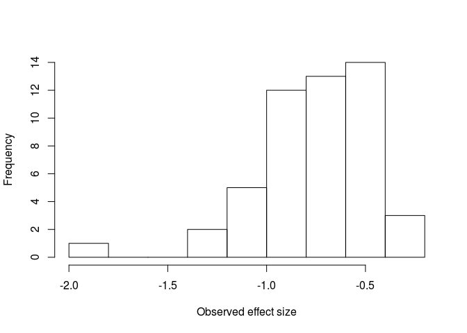<!-- -->

* IV (x): Mean age of participants

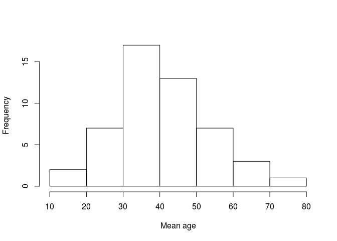<!-- -->


# R
* There are several [packages](https://cran.r-project.org/web/views/MetaAnalysis.html) to conduct meta-analysis in [R](https://www.r-project.org/). We are going to illustrate the procedures with the [metaSEM](https://cran.r-project.org/web/packages/metaSEM/index.html) package.

## Fixed-effects model

```r
## You need to install the metaSEM package before using it. 
## You need to install it only once.
## install.packages("metaSEM") 

## Load the library
library(metaSEM)

## Read the data file
my.df <- read.csv("data.csv")

## Display the first few studies
head(my.df)
```

```
##         y      v     x
## 1 -1.8586 0.0743 64.92
## 2 -0.7913 0.0545 50.71
## 3 -0.6882 0.0375 39.71
## 4 -0.5261 0.0360 42.21
## 5 -0.4075 0.0412 34.43
## 6 -1.3356 0.0404 54.05
```

```r
## Fixed-effects model by restricting the random effects to 0
summary(meta(y=y, v=v, data=my.df, RE.constraints = 0))
```

```
## 
## Call:
## meta(y = y, v = v, data = my.df, RE.constraints = 0)
## 
## 95% confidence intervals: z statistic approximation
## Coefficients:
##             Estimate Std.Error    lbound    ubound z value  Pr(>|z|)    
## Intercept1 -0.722451  0.028878 -0.779052 -0.665851 -25.017 < 2.2e-16 ***
## ---
## Signif. codes:  0 '***' 0.001 '**' 0.01 '*' 0.05 '.' 0.1 ' ' 1
## 
## Q statistic on the homogeneity of effect sizes: 85.71155
## Degrees of freedom of the Q statistic: 49
## P value of the Q statistic: 0.0009179457
## 
## Heterogeneity indices (based on the estimated Tau2):
##                              Estimate
## Intercept1: I2 (Q statistic)        0
## 
## Number of studies (or clusters): 50
## Number of observed statistics: 50
## Number of estimated parameters: 1
## Degrees of freedom: 49
## -2 log likelihood: 19.40719 
## OpenMx status1: 0 ("0" or "1": The optimization is considered fine.
## Other values may indicate problems.)
```

## Random-effects model

```r
summary(meta(y=y, v=v, data=my.df))
```

```
## 
## Call:
## meta(y = y, v = v, data = my.df)
## 
## 95% confidence intervals: z statistic approximation
## Coefficients:
##              Estimate  Std.Error     lbound     ubound  z value Pr(>|z|)
## Intercept1 -0.7286574  0.0373260 -0.8018151 -0.6554997 -19.5214  < 2e-16
## Tau2_1_1    0.0272966  0.0148155 -0.0017412  0.0563344   1.8424  0.06541
##               
## Intercept1 ***
## Tau2_1_1   .  
## ---
## Signif. codes:  0 '***' 0.001 '**' 0.01 '*' 0.05 '.' 0.1 ' ' 1
## 
## Q statistic on the homogeneity of effect sizes: 85.71155
## Degrees of freedom of the Q statistic: 49
## P value of the Q statistic: 0.0009179457
## 
## Heterogeneity indices (based on the estimated Tau2):
##                              Estimate
## Intercept1: I2 (Q statistic)   0.3955
## 
## Number of studies (or clusters): 50
## Number of observed statistics: 50
## Number of estimated parameters: 2
## Degrees of freedom: 48
## -2 log likelihood: 13.01445 
## OpenMx status1: 0 ("0" or "1": The optimization is considered fine.
## Other values may indicate problems.)
```

## Mixed-effects model

```r
summary(meta(y=y, v=v, x=x, data=my.df))
```

```
## 
## Call:
## meta(y = y, v = v, x = x, data = my.df)
## 
## 95% confidence intervals: z statistic approximation
## Coefficients:
##              Estimate  Std.Error     lbound     ubound z value  Pr(>|z|)
## Intercept1 -0.4439440  0.1214427 -0.6819674 -0.2059207 -3.6556 0.0002566
## Slope1_1   -0.0071136  0.0029137 -0.0128244 -0.0014029 -2.4414 0.0146292
## Tau2_1_1    0.0214313  0.0132301 -0.0044992  0.0473618  1.6199 0.1052553
##               
## Intercept1 ***
## Slope1_1   *  
## Tau2_1_1      
## ---
## Signif. codes:  0 '***' 0.001 '**' 0.01 '*' 0.05 '.' 0.1 ' ' 1
## 
## Q statistic on the homogeneity of effect sizes: 85.71155
## Degrees of freedom of the Q statistic: 49
## P value of the Q statistic: 0.0009179457
## 
## Explained variances (R2):
##                            y1
## Tau2 (no predictor)    0.0273
## Tau2 (with predictors) 0.0214
## R2                     0.2149
## 
## Number of studies (or clusters): 50
## Number of observed statistics: 50
## Number of estimated parameters: 3
## Degrees of freedom: 47
## -2 log likelihood: 7.187943 
## OpenMx status1: 0 ("0" or "1": The optimization is considered fine.
## Other values may indicate problems.)
```


# Mplus
* [Mike Cheung](https://courses.nus.edu.sg/course/psycwlm/internet/) provides sample [Mplus code](https://github.com/mikewlcheung/metaSEM-book/blob/master/metaSEMbook.md) on how to conduct meta-analysis in [Mplus](https://www.statmodel.com/).
* The sample data set for Mplus is available [here](./mplus/data.dat).


## Fixed-effects model
[Mplus input file](./mplus/mplus1.inp)
```
TITLE:  Fixed-effects model
DATA:   FILE IS data.dat;    
VARIABLE: NAMES y v x;
        USEVARIABLES ARE y w2;  ! Use both y and w2 in the analysis

DEFINE: w2 = SQRT(v**(-1));     ! Weight for transformation           
        y = w2*y;               ! Transformed effect size

MODEL:
        [y@0.0];                ! Intercept fixed at 0
        y@1.0;                  ! Error variance fixed at 1
        y ON w2;                ! Common effect estimate beta_F

OUTPUT: SAMPSTAT;
        CINTERVAL(symmetric);   ! Wald CI
```
[Mplus output file](./mplus/mplus1.out)
```
Mplus VERSION 7.4
MUTHEN & MUTHEN
02/20/2016   2:05 PM

INPUT INSTRUCTIONS

  TITLE:  Fixed-effects model
  DATA:   FILE IS data.dat;
  VARIABLE: NAMES y v x;
          USEVARIABLES ARE y w2;  ! Use both y and w2 in the analysis

  DEFINE: w2 = SQRT(v**(-1));     ! Weight for transformation
          y = w2*y;               ! Transformed effect size

  MODEL:
          [y@0.0];                ! Intercept fixed at 0
          y@1.0;                  ! Error variance fixed at 1
          y ON w2;                ! Common effect estimate beta_F

  OUTPUT: SAMPSTAT;
          CINTERVAL(symmetric);   ! Wald CI


INPUT READING TERMINATED NORMALLY


Fixed-effects model

SUMMARY OF ANALYSIS

Number of groups                                                 1
Number of observations                                          50

Number of dependent variables                                    1
Number of independent variables                                  1
Number of continuous latent variables                            0

Observed dependent variables

  Continuous
   Y

Observed independent variables
   W2


Estimator                                                       ML
Information matrix                                        OBSERVED
Maximum number of iterations                                  1000
Convergence criterion                                    0.500D-04
Maximum number of steepest descent iterations                   20

Input data file(s)
  data.dat

Input data format  FREE


SAMPLE STATISTICS

     SAMPLE STATISTICS

           Means
              Y             W2
              ________      ________
      1        -3.568         4.881

           Covariances
              Y             W2
              ________      ________
 Y              1.497
 W2             0.092         0.157

           Correlations
              Y             W2
              ________      ________
 Y              1.000
 W2             0.190         1.000


UNIVARIATE SAMPLE STATISTICS

     UNIVARIATE HIGHER-ORDER MOMENT DESCRIPTIVE STATISTICS

         Variable/         Mean/     Skewness/   Minimum/ % with                Percentiles
        Sample Size      Variance    Kurtosis    Maximum  Min/Max      20%/60%    40%/80%    Median

     Y                    -3.568      -0.461      -6.819    2.00%      -4.377     -3.767     -3.399
              50.000       1.497       0.475      -1.134    2.00%      -3.282     -2.741
     W2                    4.881      -0.291       3.669    2.00%       4.623      4.784      4.891
              50.000       0.157       0.785       5.882    2.00%       4.933      5.206


THE MODEL ESTIMATION TERMINATED NORMALLY


MODEL FIT INFORMATION

Number of Free Parameters                        1

Loglikelihood

          H0 Value                         -88.803
          H1 Value                         -80.122

Information Criteria

          Akaike (AIC)                     179.605
          Bayesian (BIC)                   181.517
          Sample-Size Adjusted BIC         178.379
            (n* = (n + 2) / 24)

Chi-Square Test of Model Fit

          Value                             17.362
          Degrees of Freedom                     2
          P-Value                           0.0002

RMSEA (Root Mean Square Error Of Approximation)

          Estimate                           0.392
          90 Percent C.I.                    0.236  0.571
          Probability RMSEA <= .05           0.000

CFI/TLI

          CFI                                0.000
          TLI                               -8.154

Chi-Square Test of Model Fit for the Baseline Model

          Value                              1.839
          Degrees of Freedom                     1
          P-Value                           0.1751

SRMR (Standardized Root Mean Square Residual)

          Value                              0.322


MODEL RESULTS

                                                    Two-Tailed
                    Estimate       S.E.  Est./S.E.    P-Value

 Y        ON
    W2                -0.722      0.029    -25.017      0.000

 Intercepts
    Y                  0.000      0.000    999.000    999.000

 Residual Variances
    Y                  1.000      0.000    999.000    999.000


QUALITY OF NUMERICAL RESULTS

     Condition Number for the Information Matrix              0.100E+01
       (ratio of smallest to largest eigenvalue)


CONFIDENCE INTERVALS OF MODEL RESULTS

                  Lower .5%  Lower 2.5%    Lower 5%    Estimate    Upper 5%  Upper 2.5%   Upper .5%

 Y        ON
    W2              -0.797      -0.779      -0.770      -0.722      -0.675      -0.666      -0.648

 Intercepts
    Y                0.000       0.000       0.000       0.000       0.000       0.000       0.000

 Residual Variances
    Y                1.000       1.000       1.000       1.000       1.000       1.000       1.000


DIAGRAM INFORMATION

  Use View Diagram under the Diagram menu in the Mplus Editor to view the diagram.
  If running Mplus from the Mplus Diagrammer, the diagram opens automatically.

  Diagram output
    d:\dropbox\aaa\nerv paper\illustrations\mplus1.dgm

     Beginning Time:  14:05:23
        Ending Time:  14:05:23
       Elapsed Time:  00:00:00


MUTHEN & MUTHEN
3463 Stoner Ave.
Los Angeles, CA  90066

Tel: (310) 391-9971
Fax: (310) 391-8971
Web: www.StatModel.com
Support: Support@StatModel.com

Copyright (c) 1998-2015 Muthen & Muthen
```

## Random-effects model
[Mplus input file](./mplus/mplus2.inp)
```
TITLE:  Random-effects model
DATA:   FILE IS data.dat;    
VARIABLE: NAMES y v x;
        USEVARIABLES ARE y w2;  ! Use both y and w2 in the analysis

DEFINE: w2 = SQRT(v**(-1));     ! Weight for transformation           
        y = w2*y;               ! Transformed effect size

ANALYSIS:  TYPE=RANDOM;         ! Use random slopes analysis
           ESTIMATOR=ML;        ! Use ML estimation

MODEL:
        [y@0.0];                ! Intercept fixed at 0
        y@1.0;                  ! Error variance fixed at 1
        f | y ON w2;            ! f: Study specific random effects
        f*;                     ! var(f): tau^2
        [f*];                   ! mean(f): Average effect size beta_R

OUTPUT: SAMPSTAT;
        CINTERVAL(symmetric);   ! Wald CI
```
[Mplus output file](./mplus/mplus2.out)
```
Mplus VERSION 7.4
MUTHEN & MUTHEN
02/20/2016   2:09 PM

INPUT INSTRUCTIONS

  TITLE:  Random-effects model
  DATA:   FILE IS data.dat;
  VARIABLE: NAMES y v x;
          USEVARIABLES ARE y w2;  ! Use both y and w2 in the analysis

  DEFINE: w2 = SQRT(v**(-1));     ! Weight for transformation
          y = w2*y;               ! Transformed effect size

  ANALYSIS:  TYPE=RANDOM;         ! Use random slopes analysis
             ESTIMATOR=ML;        ! Use ML estimation

  MODEL:
          [y@0.0];                ! Intercept fixed at 0
          y@1.0;                  ! Error variance fixed at 1
          f | y ON w2;            ! f: Study specific random effects
          f*;                     ! var(f): tau^2
          [f*];                   ! mean(f): Average effect size beta_R

  OUTPUT: SAMPSTAT;
          CINTERVAL(symmetric);   ! Wald CI


INPUT READING TERMINATED NORMALLY


Random-effects model

SUMMARY OF ANALYSIS

Number of groups                                                 1
Number of observations                                          50

Number of dependent variables                                    1
Number of independent variables                                  1
Number of continuous latent variables                            1

Observed dependent variables

  Continuous
   Y

Observed independent variables
   W2

Continuous latent variables
   F


Estimator                                                       ML
Information matrix                                        OBSERVED
Maximum number of iterations                                   100
Convergence criterion                                    0.100D-05
Maximum number of EM iterations                                500
Convergence criteria for the EM algorithm
  Loglikelihood change                                   0.100D-02
  Relative loglikelihood change                          0.100D-05
  Derivative                                             0.100D-03
Minimum variance                                         0.100D-03
Maximum number of steepest descent iterations                   20
Optimization algorithm                                         EMA

Input data file(s)
  data.dat
Input data format  FREE


SAMPLE STATISTICS

     ESTIMATED SAMPLE STATISTICS

           Means
              Y             W2
              ________      ________
 1             -3.568         4.881

           Covariances
              Y             W2
              ________      ________
 Y              1.497
 W2             0.092         0.157

           Correlations
              Y             W2
              ________      ________
 Y              1.000
 W2             0.190         1.000


UNIVARIATE SAMPLE STATISTICS

     UNIVARIATE HIGHER-ORDER MOMENT DESCRIPTIVE STATISTICS

         Variable/         Mean/     Skewness/   Minimum/ % with                Percentiles
        Sample Size      Variance    Kurtosis    Maximum  Min/Max      20%/60%    40%/80%    Median

     Y                    -3.568      -0.461      -6.819    2.00%      -4.377     -3.767     -3.399
              50.000       1.497       0.475      -1.134    2.00%      -3.282     -2.741
     W2                    4.881      -0.291       3.669    2.00%       4.623      4.784      4.891
              50.000       0.157       0.785       5.882    2.00%       4.933      5.206


THE MODEL ESTIMATION TERMINATED NORMALLY


MODEL FIT INFORMATION

Number of Free Parameters                        2

Loglikelihood

          H0 Value                         -85.606

Information Criteria

          Akaike (AIC)                     175.213
          Bayesian (BIC)                   179.037
          Sample-Size Adjusted BIC         172.759
            (n* = (n + 2) / 24)


MODEL RESULTS

                                                    Two-Tailed
                    Estimate       S.E.  Est./S.E.    P-Value

 Means
    F                 -0.729      0.037    -19.522      0.000

 Intercepts
    Y                  0.000      0.000    999.000    999.000

 Variances
    F                  0.027      0.015      1.842      0.065

 Residual Variances
    Y                  1.000      0.000    999.000    999.000


QUALITY OF NUMERICAL RESULTS

     Condition Number for the Information Matrix              0.858E-01
       (ratio of smallest to largest eigenvalue)


CONFIDENCE INTERVALS OF MODEL RESULTS

                  Lower .5%  Lower 2.5%    Lower 5%    Estimate    Upper 5%  Upper 2.5%   Upper .5%

 Means
    F               -0.825      -0.802      -0.790      -0.729      -0.667      -0.656      -0.633

 Intercepts
    Y                0.000       0.000       0.000       0.000       0.000       0.000       0.000

 Variances
    F               -0.011      -0.002       0.003       0.027       0.052       0.056       0.065

 Residual Variances
    Y                1.000       1.000       1.000       1.000       1.000       1.000       1.000


DIAGRAM INFORMATION

  Use View Diagram under the Diagram menu in the Mplus Editor to view the diagram.
  If running Mplus from the Mplus Diagrammer, the diagram opens automatically.

  Diagram output
    d:\dropbox\aaa\nerv paper\illustrations\mplus2.dgm

     Beginning Time:  14:09:42
        Ending Time:  14:09:42
       Elapsed Time:  00:00:00


MUTHEN & MUTHEN
3463 Stoner Ave.
Los Angeles, CA  90066

Tel: (310) 391-9971
Fax: (310) 391-8971
Web: www.StatModel.com
Support: Support@StatModel.com

Copyright (c) 1998-2015 Muthen & Muthen
```

## Mixed-effects model
[Mplus input file](./mplus/mplus2.inp)
```
TITLE:  Random-effects model
DATA:   FILE IS data.dat;    
VARIABLE: NAMES y v x;
        USEVARIABLES ARE y w2;  ! Use both y and w2 in the analysis

DEFINE: w2 = SQRT(v**(-1));     ! Weight for transformation           
        y = w2*y;               ! Transformed effect size

ANALYSIS:  TYPE=RANDOM;         ! Use random slopes analysis
           ESTIMATOR=ML;        ! Use ML estimation

MODEL:
        [y@0.0];                ! Intercept fixed at 0
        y@1.0;                  ! Error variance fixed at 1
        f | y ON w2;            ! f: Study specific random effects
        f*;                     ! var(f): tau^2
        [f*];                   ! mean(f): Average effect size beta_R

OUTPUT: SAMPSTAT;
        CINTERVAL(symmetric);   ! Wald CI
```
[Mplus output file](./mplus/mplus2.out)
```
Mplus VERSION 7.4
MUTHEN & MUTHEN
02/20/2016   2:09 PM

INPUT INSTRUCTIONS

  TITLE:  Random-effects model
  DATA:   FILE IS data.dat;
  VARIABLE: NAMES y v x;
          USEVARIABLES ARE y w2;  ! Use both y and w2 in the analysis

  DEFINE: w2 = SQRT(v**(-1));     ! Weight for transformation
          y = w2*y;               ! Transformed effect size

  ANALYSIS:  TYPE=RANDOM;         ! Use random slopes analysis
             ESTIMATOR=ML;        ! Use ML estimation

  MODEL:
          [y@0.0];                ! Intercept fixed at 0
          y@1.0;                  ! Error variance fixed at 1
          f | y ON w2;            ! f: Study specific random effects
          f*;                     ! var(f): tau^2
          [f*];                   ! mean(f): Average effect size beta_R

  OUTPUT: SAMPSTAT;
          CINTERVAL(symmetric);   ! Wald CI


INPUT READING TERMINATED NORMALLY


Random-effects model

SUMMARY OF ANALYSIS

Number of groups                                                 1
Number of observations                                          50

Number of dependent variables                                    1
Number of independent variables                                  1
Number of continuous latent variables                            1

Observed dependent variables

  Continuous
   Y

Observed independent variables
   W2

Continuous latent variables
   F


Estimator                                                       ML
Information matrix                                        OBSERVED
Maximum number of iterations                                   100
Convergence criterion                                    0.100D-05
Maximum number of EM iterations                                500
Convergence criteria for the EM algorithm
  Loglikelihood change                                   0.100D-02
  Relative loglikelihood change                          0.100D-05
  Derivative                                             0.100D-03
Minimum variance                                         0.100D-03
Maximum number of steepest descent iterations                   20
Optimization algorithm                                         EMA

Input data file(s)
  data.dat
Input data format  FREE


SAMPLE STATISTICS

     ESTIMATED SAMPLE STATISTICS

           Means
              Y             W2
              ________      ________
 1             -3.568         4.881

           Covariances
              Y             W2
              ________      ________
 Y              1.497
 W2             0.092         0.157

           Correlations
              Y             W2
              ________      ________
 Y              1.000
 W2             0.190         1.000


UNIVARIATE SAMPLE STATISTICS

     UNIVARIATE HIGHER-ORDER MOMENT DESCRIPTIVE STATISTICS

         Variable/         Mean/     Skewness/   Minimum/ % with                Percentiles
        Sample Size      Variance    Kurtosis    Maximum  Min/Max      20%/60%    40%/80%    Median

     Y                    -3.568      -0.461      -6.819    2.00%      -4.377     -3.767     -3.399
              50.000       1.497       0.475      -1.134    2.00%      -3.282     -2.741
     W2                    4.881      -0.291       3.669    2.00%       4.623      4.784      4.891
              50.000       0.157       0.785       5.882    2.00%       4.933      5.206


THE MODEL ESTIMATION TERMINATED NORMALLY


MODEL FIT INFORMATION

Number of Free Parameters                        2

Loglikelihood

          H0 Value                         -85.606

Information Criteria

          Akaike (AIC)                     175.213
          Bayesian (BIC)                   179.037
          Sample-Size Adjusted BIC         172.759
            (n* = (n + 2) / 24)


MODEL RESULTS

                                                    Two-Tailed
                    Estimate       S.E.  Est./S.E.    P-Value

 Means
    F                 -0.729      0.037    -19.522      0.000

 Intercepts
    Y                  0.000      0.000    999.000    999.000

 Variances
    F                  0.027      0.015      1.842      0.065

 Residual Variances
    Y                  1.000      0.000    999.000    999.000


QUALITY OF NUMERICAL RESULTS

     Condition Number for the Information Matrix              0.858E-01
       (ratio of smallest to largest eigenvalue)


CONFIDENCE INTERVALS OF MODEL RESULTS

                  Lower .5%  Lower 2.5%    Lower 5%    Estimate    Upper 5%  Upper 2.5%   Upper .5%

 Means
    F               -0.825      -0.802      -0.790      -0.729      -0.667      -0.656      -0.633

 Intercepts
    Y                0.000       0.000       0.000       0.000       0.000       0.000       0.000

 Variances
    F               -0.011      -0.002       0.003       0.027       0.052       0.056       0.065

 Residual Variances
    Y                1.000       1.000       1.000       1.000       1.000       1.000       1.000


DIAGRAM INFORMATION

  Use View Diagram under the Diagram menu in the Mplus Editor to view the diagram.
  If running Mplus from the Mplus Diagrammer, the diagram opens automatically.

  Diagram output
    d:\dropbox\aaa\nerv paper\illustrations\mplus2.dgm

     Beginning Time:  14:09:42
        Ending Time:  14:09:42
       Elapsed Time:  00:00:00


MUTHEN & MUTHEN
3463 Stoner Ave.
Los Angeles, CA  90066

Tel: (310) 391-9971
Fax: (310) 391-8971
Web: www.StatModel.com
Support: Support@StatModel.com

Copyright (c) 1998-2015 Muthen & Muthen
```

# Stata
* There are several user-contributed packages in [meta-analysis](http://www.stata.com/support/faqs/statistics/meta-analysis/) in [Stata](http://www.stata.com/).
* The followings files are used in this illustration: [data](./stata/data.csv), [do-file](./stata/stata.do), and [log file](./stata/stata.log).

## Fixed- and random-effects models
```
* Read the data file "data.csv".
. import delim using data.csv
```

```
(3 vars, 50 obs)
```

```
* Generate se (standard error) from v (sampling variance).
. generate se=sqrt(v)

* Display the content.
. describe
```

```
Contains data
  obs:            50                          
 vars:             4                          
 size:           800                          
----------------------------------------------------------------------------------------
              storage   display    value
variable name   type    format     label      variable label
----------------------------------------------------------------------------------------
y               float   %9.0g                 
v               float   %9.0g                 
x               float   %9.0g
se              float   %9.0g   
----------------------------------------------------------------------------------------
```

```
* Run a meta-analysis on y with se as the standard error.
. meta y se
```

```
Meta-analysis 

       |  Pooled      95% CI         Asymptotic      No. of
Method |     Est   Lower   Upper  z_value  p_value   studies
-------+----------------------------------------------------
Fixed  |  -0.722  -0.779  -0.666  -25.017    0.000     50
Random |  -0.729  -0.804  -0.654  -19.030    0.000

Test for heterogeneity: Q= 85.712 on 49 degrees of freedom (p= 0.001)
Moment-based estimate of between studies variance =  0.031
```

## Mixed-effects model
```
* Run a mixed-effects meta-analysis on y with x as the predictor and se as the standard error.
. metareg y x, wsse(se)
```

```
Meta-regression                                       Number of obs  =      50
REML estimate of between-study variance               tau2           =  .02432
% residual variation due to heterogeneity             I-squared_res  =  38.44%
Proportion of between-study variance explained        Adj R-squared  =  15.93%
With Knapp-Hartung modification
------------------------------------------------------------------------------
           y |      Coef.   Std. Err.      t    P>|t|     [95% Conf. Interval]
-------------+----------------------------------------------------------------
           x |  -.0071645   .0030496    -2.35   0.023    -.0132961   -.0010329
       _cons |  -.4422977   .1273233    -3.47   0.001    -.6982984   -.1862969
------------------------------------------------------------------------------
```


# SPSS 
* To use SPSS to conduct meta-analysis, we use the [macros](http://mason.gmu.edu/~dwilsonb/ma.html) provided by [David Wilson](http://mason.gmu.edu/~dwilsonb/).
* There are three macros at the site for meta-analysis. We use `MEANES` macro to conduct the basic meta-analysis, and the `METAREG` macro for study-level moderator analysis, using meta-regression. `METAF` is used to conduct moderator analysis with a categorical moderator.
* In our dataset, our study effect size is labeled `y`, its sampling variance as `v`, and moderator Mean Age of the participants as `x`. 
* Because the macros require us to input study weights, we first compute a new variable labelled `w`, which indicates the weights allotted to each study. We use the formula: w = 1/v to compute this variable.
* Once we have the variables `y`, `x`, and `w` in SPSS, we are ready to use the macros.

## Fixed- and random- effects models
* SPSS syntax:
```
INCLUDE 'C:\MEANES.SPS'.
MEANES ES = y /W = w.
```

* Output:

```
Run MATRIX procedure:

Version 2005.05.23

*****  Meta-Analytic Results  *****

------- Distribution Description ---------------------------------
           N      Min ES      Max ES    Wghtd SD
      50.000      -1.859       -.234        .267

------- Fixed & Random Effects Model -----------------------------
         Mean ES    -95%CI    +95%CI        SE         Z         P
Fixed     -.7225    -.7791    -.6659     .0289  -25.0171     .0000
Random    -.7292    -.8043    -.6541     .0383  -19.0298     .0000

------- Random Effects Variance Component ------------------------
v    =    .031257

------- Homogeneity Analysis -------------------------------------
           Q          df           p
     85.7115     49.0000       .0009

Random effects v estimated via noniterative method of moments.

------ END MATRIX -----

```

## Mixed-effects model
* There are three estimation methods that can be used: method-of-moments(M-M) which is non-iterative; maximum likelihood (ML); and restricted maximum likelihood (REML). 
* These different methods can be called by specifying one of the following commands in SPSS syntax:
    + `METAREG ES = y /W = w /IVS =   x /MODEL = MM.`
    + `METAREG ES = y /W = w /IVS =   x /MODEL = ML.`
    + `METAREG ES = y /W = w /IVS =   x /MODEL = REML.`

* We will use ML to estimate the meta-regression mixed model by the following command:
```
INCLUDE 'C:\METAREG.SPS' .
METAREG ES = y /W = w /IVS =   x /MODEL = ML.
```

* Output:

```
Run MATRIX procedure:

Version 2005.05.23

 *****  Inverse Variance Weighted Regression  *****

 *****  Random Intercept, Fixed Slopes Model  *****

------- Descriptives -------
      Mean ES     R-Square            k
       -.7277        .1020      50.0000

------- Homogeneity Analysis -------
                    Q           df            p
Model          6.0021       1.0000        .0143
Residual      52.8294      48.0000        .2929
Total         58.8314      49.0000        .1587

------- Regression Coefficients -------
                B       SE  -95% CI  +95% CI        Z        P     Beta
Constant   -.4439    .1212   -.6815   -.2064  -3.6632    .0002    .0000
x          -.0071    .0029   -.0128   -.0014  -2.4499    .0143   -.3194

------- Maximum Likelihood Random Effects Variance Component -------
v      =   .02143
se(v)  =   .01263

------ END MATRIX -----
```

# Comprehensive Meta-Analsyis (CMA)

* [CMA](https://www.meta-analysis.com/) provides a graphical user interface to conduct meta-analysis. The program has a regular spread-sheet like window. This makes it easier to copy data from spreadsheets onto this program. 

## Data Entry

* To initiate a meta-analysis, you can first include the study names into a column specially designated for it, by using the drop-down options as shown below:

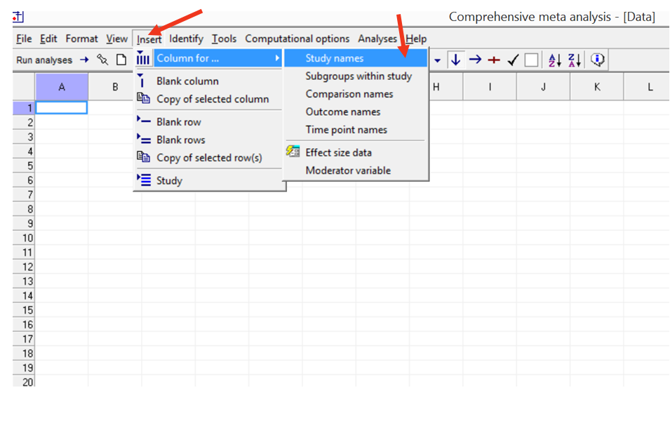

* This creates a column for the study names. It is customary to have the first author and year in the study detail. For our purposes, i just labeled studies by numbers (see screenshot below).
* After this, you can input effect sizes. CMA can accept many varieties of effect size parameters, so you need to specify it. We will specify Hedges's *d* as our effect size. 

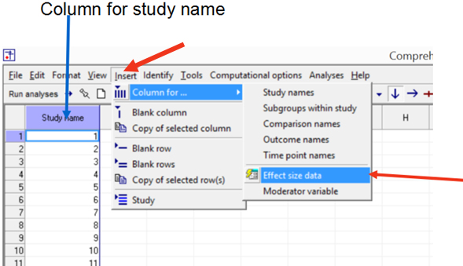

The following window pops up. Click 'Next'.

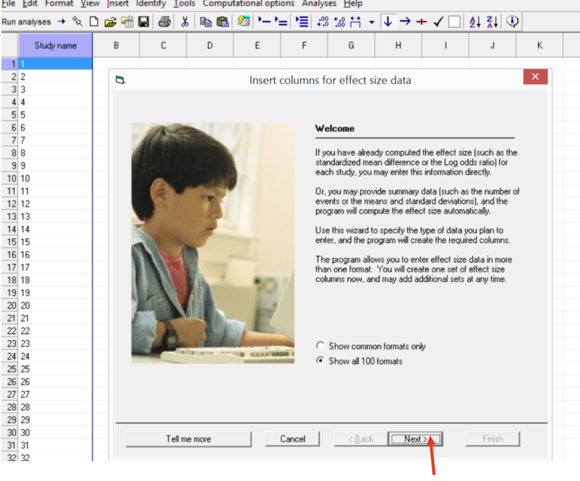

* You can now select the kind of studies you are analyzing. Here, since we are comparing studies that compare schizophrenics with a control group, we choose the first option, and then click 'Next'. See below.


* A new window appears, from which you can choose the desired effect size metric. Our metric is Hedge's *d*, so we click on 'continuous means', which gives us the option, 'computed effect sizes', which then gives us a lot of effect sizes, from which we choose Hedges's *d* with variance. See below.

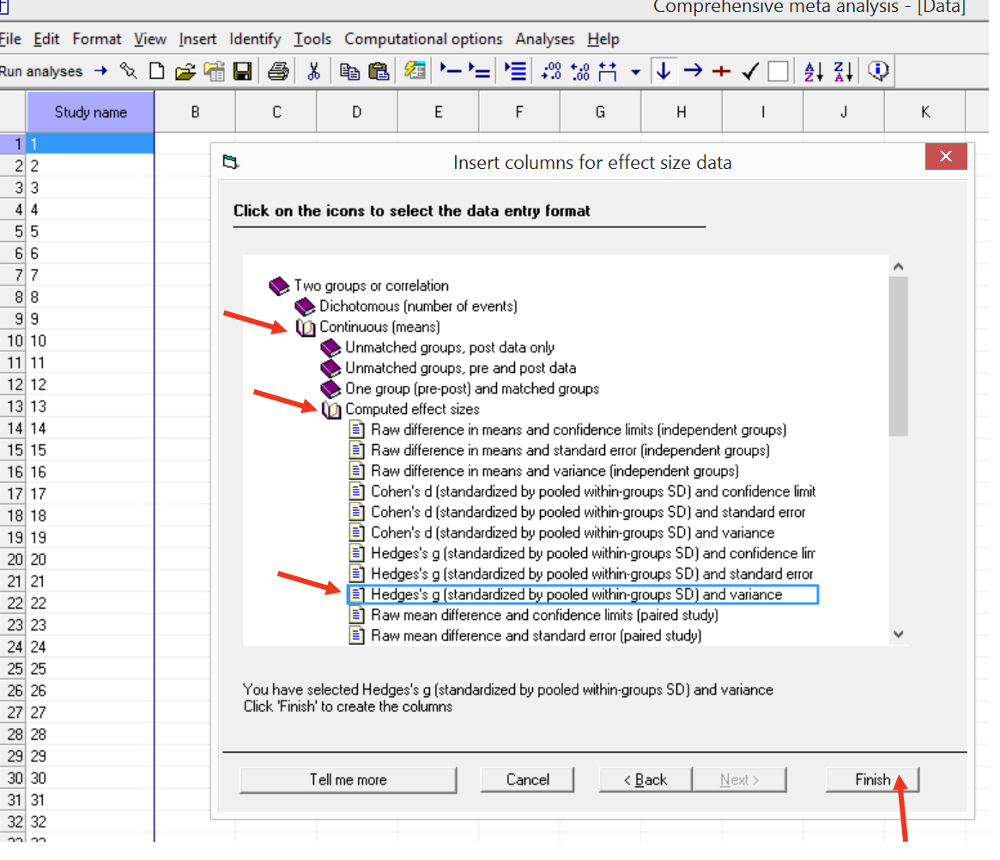

* The main window now appears with columns where we can input the effect sizes of individual studies. We can also optionally label our groups as well. We label them as 'Schizophrenia' and 'Control', as below.

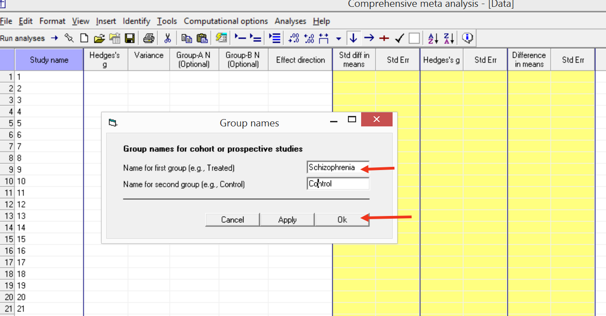

* We can now transfer our effect sizes from spreadsheets onto this window. The window after transferring our effect size and variance column is as below. 

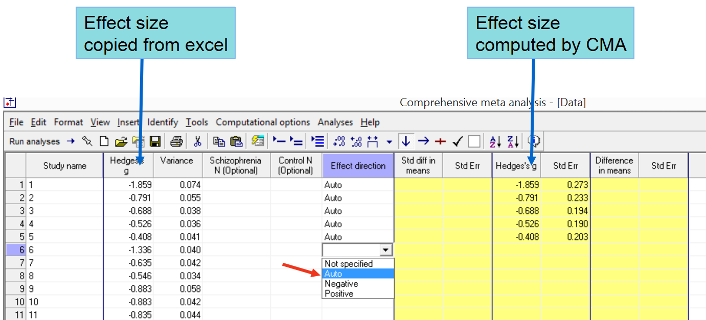

* As shown above, you have to specify the direction (sign) of the effect size. For each study we specify it to be 'auto'; it then takes the sign of our input Hedges's *d*.
* You can also see that the yellow-highlighted columns are calculated outputs by CMA. In our case, since we have given the effect sizes already, this seems redundant. But you can instead opt to input just the means and SDs of the two groups; CMA will calculate the effect size and display it in the yellow column.
* We are also interested in looking at the effect of age as a moderator. So we will include the age in the dataset as follows: 

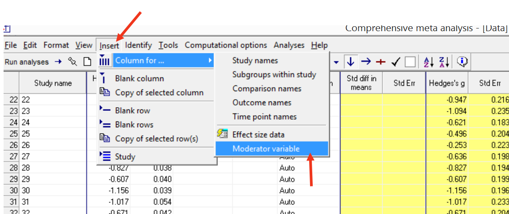

* We then get a new window where we can specify the variable name and data type. We specify 'Age' as the moderator.

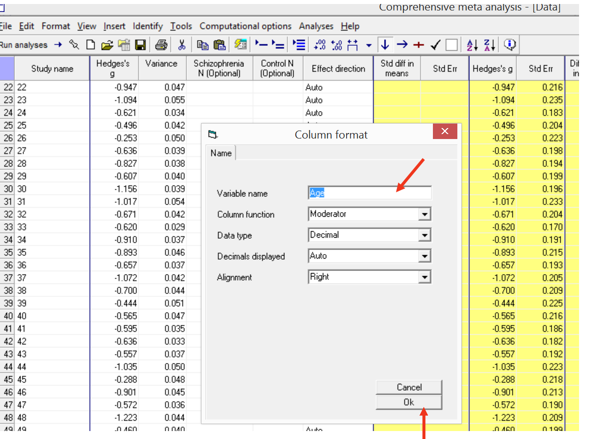

* We get the final dataset with both the effect size and moderator columns, as shown below.


* Now we can conduct our analysis. We will do both a meta-analysis using fixed effects model as well as random-effects model. We will then do a meta-regression, with age as the moderator.

## Fixed- and mixed-effects models

* Click the 'run analyses' icon, as shown below.


* The default analysis is fixed effects model, so you get the display below.

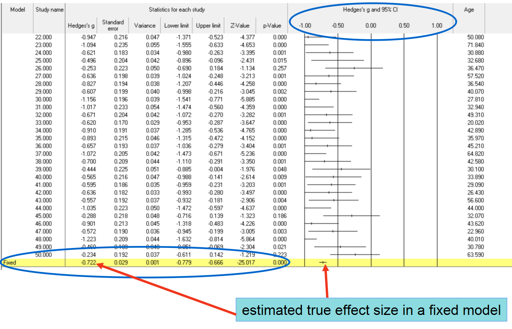

* Clicking on "Both models" icon (see figure below) will show both fixed-effects and random-effects models.

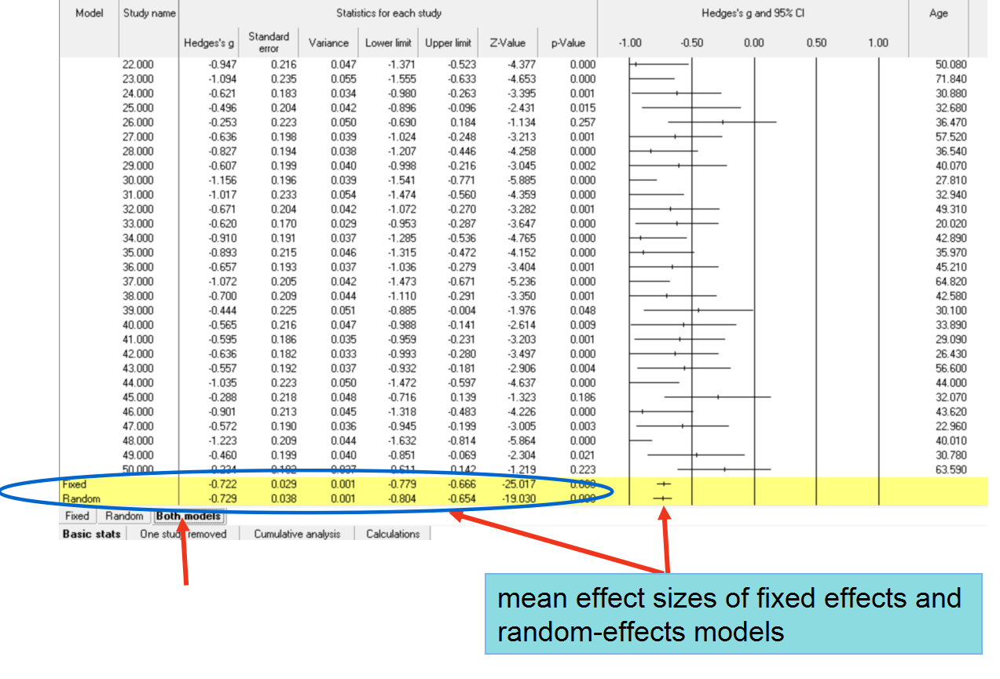

* Clicking on 'View', as shown below, brings up the 'statistics' option.

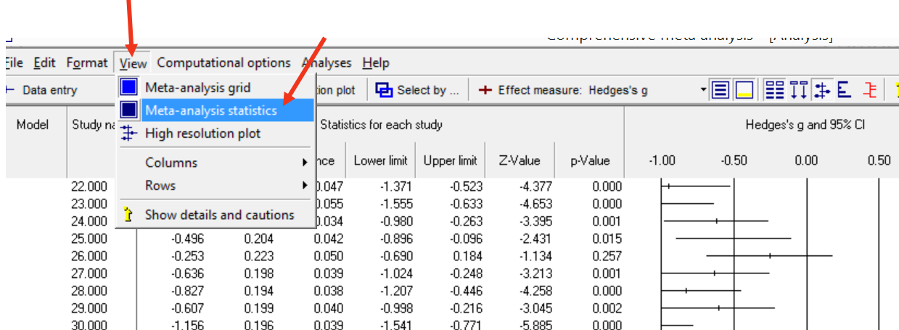

* That brings up the window below. It gives both the fixed-effects as well as random-effects results. 


## Mixed-effects model

* Click on 'analyses' and then 'meta regression 2' icons as shown below:

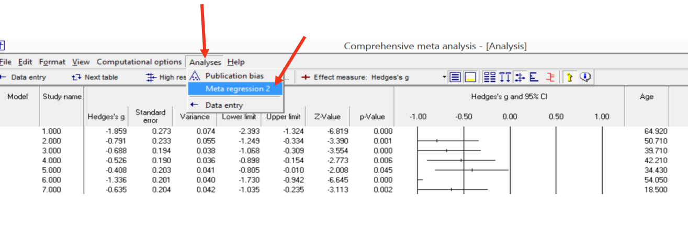

* We get the screen below. This screen shows all variables we had included in the main window spreadsheet under the label 'moderator'.  The window shows that currently, we do not have any moderators in our meta-analysis model. We specify that we should include 'age' in our model, by clicking on 'Age', and then 'Add to main screen.' 

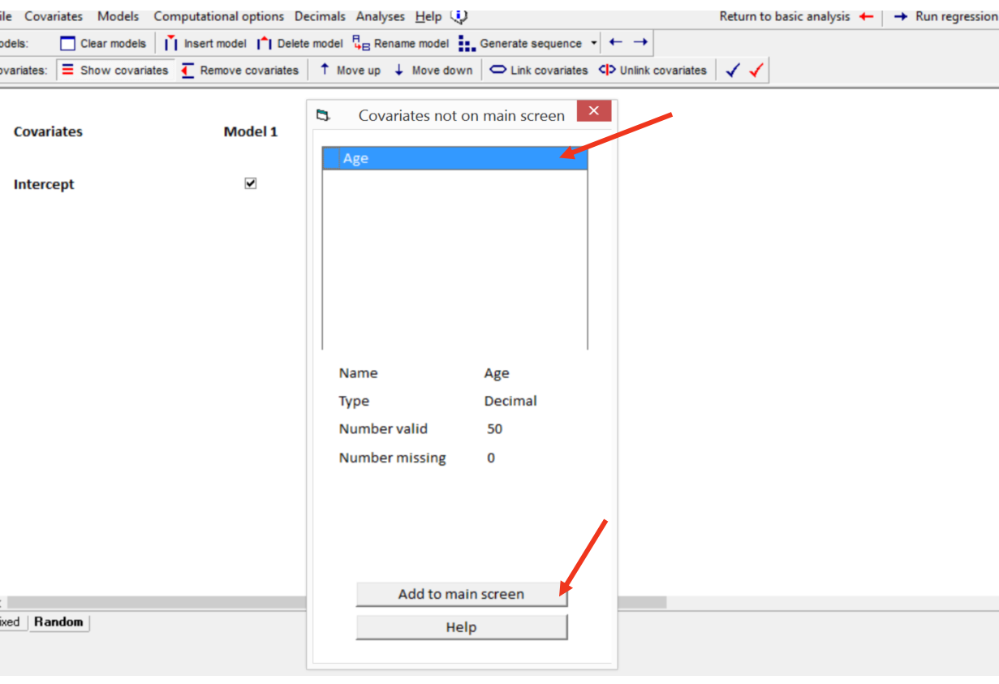

* Then, we specify the type of estimation method we want to employ ('Maximum Likelihood'), make sure the "Random" icon at the lower left is highlighted to specify a mixed model, and then click 'Run Regression'. See below.


* We get the results below:

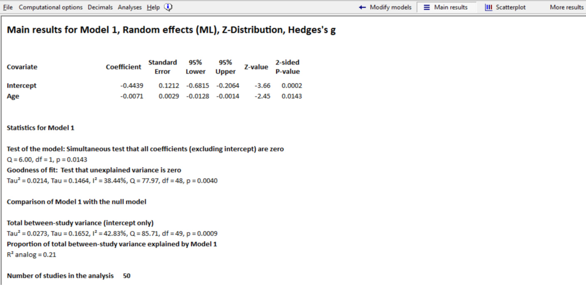

* We can get more details by clicking on the tabs at the top of the window. For instance, clicking on "Scatterplot" gives you the following figure:

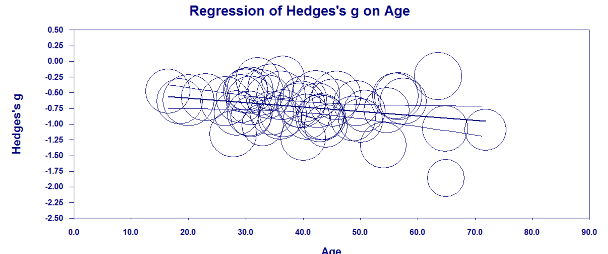

